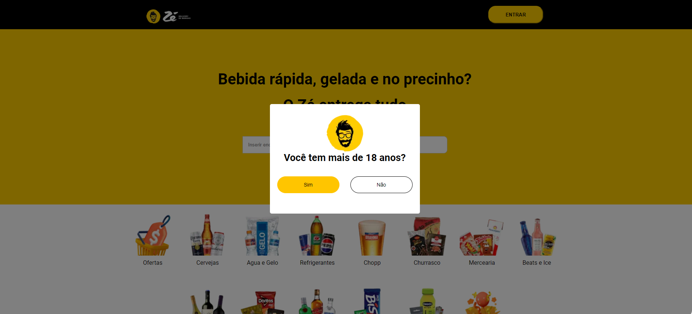

# Clone Zé Delivery

Clone pagína https://www.ze.delivery/

### Exercício curso Futuro DEV, semana 08, módulo 2

## Tecnologia ultilizadas

Reacte, Vite

## Como rodar o projeto

#### Clone este repositório em sua máquina local:

git clone https://github.com/FernandaBarrosLinhares/Clone-ZeDelivery

npm insttall
npm dev run

## Melhorias

Em desenvolvimento

## Desenvolvedora

- Fernanda Linhares (https://www.linkedin.com/in/fernanda-linhares-b10ba32b/)

